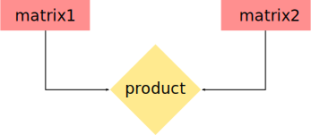

# Introduction to TensorFlow

In this chapter, we provide a very brief description of TensorFlow's basic building blocks and concepts that are used in building sophisticated models. Here we also give an overview on how the models should be structured.

## Why TensorFlow

TensorFlow is an open-source software library from Google for numerical computation using data flow graphs. It is the library that allows us to

* use variety of programming languages to build deep learning models, as it has Python, C++, Java and Go APIs,
* deploy computation to one or more CPUs or GPUs in a desktop, server, or mobile device with a single API,
* visualize learning, embedding, graphs and histograms using [TensorBoard](https://www.tensorflow.org/get_started/summaries_and_tensorboard),
* forget about derivative computations by hand as it has [auto-differentiation](http://www.columbia.edu/~ahd2125/post/2015/12/5/).

In addition, it has a large community and many projects are already using TensorFlow.

As TensorFlow matures it simplifies its interfaces, for example, TensorFlow Estimator \([tf.estimator](https://www.tensorflow.org/api_docs/python/tf/estimator)\) and TensorFlow Learn \([tf.contrib.learn](https://www.tensorflow.org/api_guides/python/contrib.learn)\), provide readily available models that users can simply call. This was purposely created to mimic `scikit-learn` for deep learning or “to smooth the transition" from the `scikit-learn` world of one-liner machine learning into the more open world of building different shapes of machine learning models.

> Note: TensorFlow Learn was originally an independent project called Scikit Flow \(SKFlow\).

Both TensorFlow Estimator and Learn allows you to load in data, construct a model, fit your model using the training data, evaluate the accuracy, just using a single line of code. Some models that you can call using one line are _LinearClassifier, LinearRegressor_ and _DNNClassifier_.

Google has some good tutorial on how to build model using [TensorFlow Estimator](https://www.tensorflow.org/get_started/estimator).

> Note: TensorFlow Contrib module, which TensorFlow Learn is part of, contains volatile or experimental code.

Another notable addition to the TensorFlow is the implementation of the [Keras](https://keras.io/) API, that significantly reduces the number of lines and improves readability of the code. See [TensorFlow Keras](https://www.tensorflow.org/api_docs/python/tf/contrib/keras).

However, the primary purpose of TensorFlow is not to provide out-of-the-box machine learning solutions. Instead, TensorFlow provides an extensive suite of functions and classes that allow users to define models from scratch. This is more complicated but offers much more flexibility. You can build almost any architecture you can think of in TensorFlow. For that reason, we will not use TensorFlow Estimator, Learn and Keras interfaces, but stick with basic TensorFlow. In addition, we will avoid using Python classes and functions where possible as it might confuse some readers if they are new to Python. However, note it is often better to define models as a class.

## What is TensorFlow

Most notable difference between TensorFlow and other libraries is that TensorFlow does all its computation in graphs. A TensorFlow graph is a description of operands and operations that are required to perform a task. This means, that TensorFlow programs separate the definition of computations from their execution. For more details on computational graphs see the following:

* [Calculus on Computational Graphs: Backpropagation](http://colah.github.io/posts/2015-08-Backprop/)
* [What is a TensorFlow Session?](http://danijar.com/what-is-a-tensorflow-session/)
* [Graphs and Sessions](https://www.tensorflow.org/versions/master/programmers_guide/graphs)

So, a computational graph is a series of TensorFlow operations arranged in a graph of nodes. In the graph, nodes are called _ops_ which is short-hand for _operations_. An _op_ takes zero or more _Tensors_, performs some computation, and then again produces zero or more _Tensors_. As you might suspect, in TensorFlow, _Tensor_ is the basic object and it uses a[ tensor](https://en.wikipedia.org/wiki/Tensor) data structure to represent all data - only tensors are passed between operations in the computation graph. You can think of a _Tensor_ as an n-dimensional array or list. The _Tensor_ has a static type, a rank, and a shape. To learn more about how TensorFlow handles these concepts, see the [Rank, Shape, and Type reference](https://www.tensorflow.org/programmers_guide/dims_types).

For example, in the case of the patient records, \_Tensor\_could be a three-dimensional array with dimensions **\[patients, record\_lengh, events\]** or in case of images it is a four-dimensional array with dimensions **\[images, height, width, colors\]**.

## How does TensorFlow works

As the example, to build a graph we start with _ops_ that do not need any input, such as `Constant`, and pass their output to other _ops_ that does a computation. The _ops_ constructors in the Python library return objects that stand for the output of the constructed _ops_. You can pass these to other _ops_ constructors to use as inputs. The TensorFlow Python library has a default graph to which _ops_ constructors add nodes. The default graph is sufficient for many applications.

> Note: `tf` in all scripts that follow stands for **tensorflow**.

Thus, first we define the computational graph by adding nodes to the default graph, in Python it could be written as follows:

```python
import tensorflow as tf
# Create a Constant op that produces a 1x2 matrix.  The op is
# added as a node to the default graph.

# The value returned by the constructor represents the output
# of the Constant op. It is matrix of shape 1x2.
matrix1 = tf.constant([[1., 2.]])
# Create another Constant that produces a 2x1 matrix.
matrix2 = tf.constant([[3.], [4.]])
# Create a Matmul op that takes "matrix1" and "matrix2" as inputs.
# The returned value, "product", represents the result of the matrix
# multiplication. Output is a matrix of shape 1x1.
product = tf.matmul(matrix1, matrix2)
```

The default graph now has three nodes: two `tf.constant()` _ops_ and one `tf.matmul()` _op._ If we try to draw it on a paper then it could look stomething like this:



If we try to execute the code presented above, we, unfortunately, will not get a useful answer. In Tenserflow to actually perform the computation and get the result, we have to launch the graph in a session. Thus, to multiply the matrices and get the result of the multiplication, we have to create a `Session` object without arguments, which launches the default graph.

```python
# Launch the default graph.
sess = tf.Session()
```

Then call `run()` method which executes of all three _ops_ in the graph,

```python
result = sess.run(fetches=product)
print(result)  # expected value is [[ 11.]]
```

After which `Session` has to be closed by running `sess.close()`. However, it is also possible to enter the `Session` with a `with` block. Doing so, the `Session` will close automatically at the end of the `with` block and thus `sess.close()` is not needed:

```python
with tf.Session() as sess:
  result = sess.run(fetches=product)
  print(result)
```

You sometimes see `InteractiveSession()` instead of `Session()`. The only difference is that `InteractiveSession()` makes itself the default `Session` and thus can call `Tensor.eval()` and/or `Operation.run()` without explicitly calling the `Session` every time you want to compute something. This is a convenient feature in interactive shells, such as [Jupyter Notebooks](http://jupyter.org/), as it avoids having to pass an explicit `Session` object to run _ops_ every time. However, it is complicated when you have multiple `Sessions` objects to run. For more information see [here](https://learningtensorflow.com/lesson5/)

## Data Types in TensorFlow

TensorFlow takes in Python native types such as Python boolean, numeric values \(integers, floats\) and strings. Single values will be converted to 0-D tensors \(or scalars\), lists of values will be converted to 1-D tensors \(vectors\), lists of lists will be converted to 2-D tensors \(matrices\), and so on. However, TensorFlow also has its own data types, such as, `tf.int32`, `tf.float32`, for more detailed description see [here](https://www.tensorflow.org/programmers_guide/dims_types). These types are actually based on those of NumPy and thus, in most cases, they can be used interchangeably.

## Next

[Next chapter](logistic-regression.md) will show how to implement logistic regression in TensorFlow, if you wish to return to previous chapter press [here](python-environment-set-up.md).

## Code

* [00\_first\_step.py](https://github.com/satonreb/tensorflow-tutorial/blob/master/00_first_step.py)

## References

* [Automatic Differentiation](introduction-to-tensorflow.md)
* [colah's blog](http://colah.github.io/)
* [CS 20SI: Tensorflow for Deep Learning Research](http://web.stanford.edu/class/cs20si/index.html)
* [Danijar Hafner](http://danijar.com/)
* [Keras](https://keras.io/)
* [Jupyter](http://jupyter.org/)
* [LearningTensorFlow.com](https://learningtensorflow.com/)
* [TensorFlow](https://github.com/satonreb/tensorflow-tutorial/tree/3fe10c6bcd8a0b492eca7cfd4216abfe873d47a5/www.tensorflow.org)
* Wikipedia article on [Tensor](https://en.wikipedia.org/wiki/Tensor)

