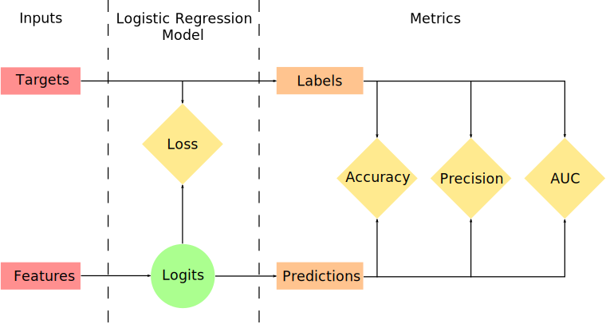

# Logistic Regression

This chapter presents the first fully-fledged example of Logistic Regression that uses commonly utilised TensorFlow structures.

## Data set

For this example the data set comes from [UC Irvine Machine Learning Repository](https://archive.ics.uci.edu/ml/index.php):

* Name: Breast Cancer Wisconsin \(Diagnostic\) Data Set \(_wdbc.data_ and _wdbc.names_\)
* Source: [http://archive.ics.uci.edu/ml/machine-learning-databases/breast-cancer-wisconsin/](http://archive.ics.uci.edu/ml/machine-learning-databases/breast-cancer-wisconsin/)

## Data Preparation

As every data is slightly different and every question that we want to answer is different and for brevity, we are going to give only a brief overview on how data were prepared. In order to use presented model, it does not matter how an where you prepare your data but you always have to have final data in the shape that is equal to the shape that is passed to the computational graph in this example.

We start by reading in the data file _wdbc.data_, where first two columns names are taken from supplementary the file _wdbc.names_ for convenience the remaining columns are just numbered from 1 to 30 with the prefix `rv_`. After reading in, we split the set into outcome/target and feature/predictors sets, and drop `ID` column. At this stage, we have two data frames, one for target values with shape \(569 rows x 1 columns\) and one for features, which shape is \(569 rows x 30 columns\).

Further, we one-hot encode target set and convert it to a numpy array. As we have only two categories, _B_ for benign and _M_ for malignant, in the set, the shape of the array becomes `[569, 2]`. Here 569 rows represent a number of observations and 2 columns stand for outcome classes.

Next, we split both, target and feature, sets into training, validation and test arrays using `train_test_split()` function from `scikit-learn` package. Length of the test data set is chosen to be 1/3 of the training and the validation data sets, subsequently, the validations set is 1/3 of the training set.

To conclude this stage, we rescale all feature data sets so that the values are between 0 and 1. In this example, we use `MinMaxScaler()` function from `scikit-learn` package that scales each column individually using the following equation,


In this example, the scaling function outputs numpy array of the same size as input data frame, in this case, it is 569 rows and 30 columns when combined.

> Note: Statistics that are used in the scaling functions are computed on the training data and only then are used to scale validation and training sets.

## Graph Construction

As mentioned in the previous chapter, the most differentiating part of the TensorFlow from the other libraries is that a model or "an analysis plan" has to be constructed before it is actually executed. In TensorFlow models are represented as [graphs](https://www.tensorflow.org/api_guides/python/framework) where operations as nodes and edges carry tensors/weights.  
Our task is to build the following graph:



I what follows we are going to follow the same structure as it can be seen in the graph above, thus we start with setting up inputs.

### Inputs

Lines that define input section of the graph are as follows:

```python
# Define inputs to the model
with tf.variable_scope("inputs"):
    # placeholder for input Feature values
    x = tf.placeholder(dtype=tf.float32, shape=[None, X_FEATURES], name="predictors")
    # placeholder for Target values
    y_true = tf.placeholder(dtype=tf.float32, shape=[None, Y_FEATURES], name="target")
```

Here [`tf.variable_scope()`](https://www.tensorflow.org/api_docs/python/tf/variable_scope) is a function that creates namespace for both variables and operators in the default graph. Namespaces are a way to organize names for variables and operators in a hierarchical manner, in our example names of `x` and `y_true`are _inputs/predictors_ and _inputs/target_, respectively.

> Note: Aanother function that creates namespace only for operators in the default graph is[`tf.name_scope()`](https://www.tensorflow.org/api_docs/python/tf/name_scope).

Further, [`tf.placeholder()`](https://www.tensorflow.org/api_docs/python/tf/placeholder) is, as the name suggests, just a placeholder for the value that will be supplied at a later date, in other words, this function allows assemble the graphs first without knowing the values needed for a computation.

> Note: This is equivalent to writing a function on the paper, for example,  where  is just a placeholder for the actual values.

To define a placeholder, it is necessary to define `dtype` parameter that specifies the data type of the values that it is going to contain. The second required parameter is `shape` which specifies the shape of the placeholder tensor and the shape that will be passed to the placeholder. If `shape = None`, this means that tensors of any shape will be accepted. Using `shape = None` it is easy to construct the graphs, but nightmarish for debugging. You should always define the shape of your placeholders as detailed as possible.

In this example, we know that our features dataset shape is 569 by 30. This means that when we create a placeholder for `x` the shape should be `[569, 30]`. However, as it is computationally more efficient to feed to the graph small batches rather than a full data set at once, we will split 569 samples into smaller chunks. The size of each chunk/batch in the script is given by `BATCH_SIZE` value. Therefore the placeholder's shape is `[BATCH_SIZE, 30]`. In some situations, the last batch may be shorter than `BATCH_SIZE` value and this could potentially "break the code". In order to avoid this situation, we write `[None, X_FEATURES]`, where `X_FEATURES = 30` for convenience and `None` stands for an arbitrary number. Similarly, we define the placeholder for `y_true`, which shape is `[None, Y_FEATURES]` where in our case `Y_FEATURES = 2`.

> Note: You can also give your placeholder a name as you can any other _op_ in TensorFlow.

Next section in the graph is the definition of the Logistic Regression Model itself.

### Logistic Regression Model

At this stage we define an operations which first compute predictions for a given input and then the prediction is passed to a loss function which subsequently is passed to an optimisation function. In our example this is written as:

```python
# Define logistic regression model
with tf.variable_scope("logistic_regression"):
    # Predictions are performed by Y_FEATURES neurons in the output layer
    logits = tf.layers.dense(inputs=x, units=Y_FEATURES, name="prediction")
    # Define loss and training
    # Cost function of the model is cross-entropy loss
    loss = tf.losses.softmax_cross_entropy(onehot_labels=y_true, logits=logits)
    # Current training is preformed using Adam optimiser which minimizes the loss function as each step
    # train_step = tf.train.AdamOptimizer(learning_rate=LEARNING_RATE).minimize(loss=loss)
    train_step = tf.train.GradientDescentOptimizer(learning_rate=LEARNING_RATE).minimize(loss=loss)
```

First, [`tf.layers.dense()`](https://www.tensorflow.org/api_docs/python/tf/layers/dense) is, as names suggest, a layer of fully-connected "neurons". Here `units`, which is a required parameter, defines a number of "neurons" in the layer. Another required parameter for this function is `inputs` that takes in our input tensor `x`, but `name` is an optional parameter. As in this example, we have only two target classes, `units`parameter then is equal to `Y_FEATURES` or 2.

To determine how well our model performs we compute the loss/cost. This example is a classification task, thus we choose [cross-entropy cost function](http://neuralnetworksanddeeplearning.com/chap3.html#the_cross-entropy_cost_function) to be our loss function. In the script it is computed using [`tf.losses.softmax_cross_entropy()`](https://www.tensorflow.org/api_docs/python/tf/losses/softmax_cross_entropy) function. It has two required parameters `onehot_labels` that takes in target input tensor and _logits_ for prediction tensor.

Further, to actually train a model or, in the other words, find the "best" values for weights and biases, TensorFlow has Optimizer class which provides methods to compute gradients for a loss function and apply them to variables. TensorFlow contains a large collection of built-in optimization algorithms, see [here](https://www.tensorflow.org/api_guides/python/train). In this particular example we are using [`tf.train.GradientDescentOptimizer()`](https://www.tensorflow.org/api_docs/python/tf/train/GradientDescentOptimizer) _op_ which implements the [gradient descent](https://en.wikipedia.org/wiki/Gradient_descent) algorithm. This function requires only one parameter and that is the `learning_rate` which is just a step size in the gradient descent algorithm. Next, `minimize(loss)` takes care of both computing the gradients and applying them to the variables. This operation is, by convention, known as the _train\_op_ and is what must be run by a TensorFlow session in order to perform one full training step.

#### Hyperparameters

This model has two parameters that only influence input and output layer shapes, these are, `X_FEATURES` which is a number of input features, and `Y_FEATURES` - the number of output classes or a number of "neurons" in the output layer.

However, other parameters \(hyperparameters\) that have to be supplied to the graph during construction, and they also influence the model and training, are:

* `BATCH_SIZE` - length of input array,
* `LEARNING_RATE` that is a value that corresponds to a step size in gradient descent algorithm,
* `EPOCHS` - a number of times the model is going to see the whole data set.
* Optimization algorithm 

### Metrics

This section is optional and is presented here as an example, showcasing TensorFlow's built-in functions.

```python
# Define metric ops
with tf.variable_scope("metrics"):
    predictions = tf.argmax(input=logits, axis=1)
    labels = tf.argmax(input=y_true, axis=1)
    _, accuracy = tf.metrics.accuracy(labels=labels, predictions=predictions)
    _, auc = tf.metrics.auc(labels=labels, predictions=predictions, curve="ROC", name="auc")
    _, precision = tf.metrics.precision(labels=labels, predictions=predictions)
```

First, we find indices with the largest value across column axis of logit and target tensors using [`tf.argmax()`](https://www.tensorflow.org/api_docs/python/tf/argmax). This function takes in a tensor and axis that specifies which axis of the input tensor to reduce across. Then we use these values to compute [`accuracy`](https://www.tensorflow.org/api_docs/python/tf/metrics/accuracy), [`auc`](https://www.tensorflow.org/api_docs/python/tf/metrics/auc) and [`precision`](https://www.tensorflow.org/api_docs/python/tf/metrics/precision) for the model. Other metrics can be found [here](https://www.tensorflow.org/api_docs/python/tf/metrics).

## Model Training

As mentioned earlier, TensorFlow separates model definition and model execution, and we have already seen how to define the model, thus we are left just with training it.

The first step is attaching `Session` to the graph and initializing all variables. This is achieved by these lines of code:

```python
# Attaches graph to session
sess = tf.InteractiveSession()
# Initialises valuables in the graph
init_global = tf.global_variables_initializer()
init_local = tf.local_variables_initializer()
sess.run(fetches=[init_global, init_local])
```

Here we use `tf.InteractiveSession()` function to attach the `Session` to the graph. This allows us to use model interactively in **PyCharm** or **Jupyter Notebooks**. Later, we define global and local variables and initialize them by executing the `Session`. In general, a majority of TensorFlow functions require only global variables to be initialized, however when `tf.metrics` is used local variables also are required.

> Note: Currently, TensorFlow community tries to change how variable initialization works and for the time being it is advisable to initialize global variables. However, if errors appear during graph's execution, initialize local variables as well.

After initialization, we are left only with training the data set which is achieved by creating a loop \(not all loops in Python are bad\).

```python
for e in range(EPOCHS + 1):
    # At the beginning of each epoch the training data set is reshuffled in order to avoid dependence on
    # input data order.
    np.random.shuffle(idx)
    # Creates a batch generator.
    batch_generator = (idx[i * BATCH_SIZE:(1 + i) * BATCH_SIZE] for i in range(n_batches))
    # Loops through batches.
    for _ in range(n_batches):
        # Gets a batch of row indices.
        id_batch = next(batch_generator)
        # Defines input dictionary
        feed = {x: X_train[id_batch], y_true: Y_train[id_batch]}
        # Executes the graph
        sess.run(fetches=train_step, feed_dict=feed)

    if e % 100 == 0:
        # Evaluate metrics on training and validation data sets
        train_loss = loss.eval(feed_dict={x: X_train, y_true: Y_train})
        train_acc = accuracy.eval(feed_dict={x: X_train, y_true: Y_train})
        val_loss = loss.eval(feed_dict={x: X_val, y_true: Y_val})
        val_acc = accuracy.eval(feed_dict={x: X_val, y_true: Y_val})
        # Prints the metrics to the console
        msg = ("Epoch: {e}/{epochs}; ".format(e=e, epochs=EPOCHS) +
               "Train loss: {tr_ls}, accuracy: {tr_acc}; ".format(tr_ls=train_loss, tr_acc=train_acc) +
               "Validation loss: {val_ls}, accuracy: {val_acc}; ".format(val_ls=val_loss, val_acc=val_acc))
        print(msg)
```

The outer loop is for epochs in which we first shuffle input array indices and then define a [Python generator](https://wiki.python.org/moin/Generators) for a batch creation. This function takes in a list of indices and creates a slice that contains `BATCH_SIZE` number or less of elements. The inner explicit loop is over a number of batches that are computed beforehand. In the loop, [`next()`](https://www.programiz.com/python-programming/methods/built-in/next) function takes in our predefined Python generator and returns a list of index values of length `BATCH_SIZE`. Every time this function is executed function retrieves the next item in the iterator.

Having obtained the list of indices, we construct an input `feed` dictionary, where we define which input array is assigned to which placeholder in the graph. In this example, we train our model using batches and thus we provide only slices of whole target and feature datasets. Then we execute the graph, by supplying the [`run`](https://www.tensorflow.org/api_docs/python/tf/Session#run) method with two parameters, `fetches` which may be a single graph element or list of an arbitrary number of graph elements, and `feed_dict` corresponds to input values.

The `run` method executes graph only one step at a time, thus iterating over a number of batches where at each iteration a new input batch is created and supplied to the graph, it has to modify weights and biases in order to find a middle-ground that would satisfy all training input data. Following `if` statement is optional, as it allows us to follow the training progress. It states that after every 100 epochs we wish to evaluate _total_ _loss_ and _accuracy_ for whole training and validation sets, and then print it to the console.

The code presented above provides all the necessary steps in order to build and train a simple logistic regression model. However, as we have started our `Session` in the interactive mode, we might also test the model and perform additional computations.

## Model Testing

For the testing purposes, in addition to _accuracy_, we compute _AUC_ and _precision_ for the test data set and print these results to the console.

```python
# Evaluate accuracy, AUC and precision on test data
test_auc = auc.eval(feed_dict={x: X_test, y_true: Y_test})
test_acc = accuracy.eval(feed_dict={x: X_test, y_true: Y_test})
test_precision = precision.eval(feed_dict={x: X_test, y_true: Y_test})
msg = "\nTest accuracy: {acc}, AUC: {auc} and precision: {prec}".format(acc=test_acc, auc=test_auc, prec=test_precision)
print(msg)
```

The remaining code in the script creates the confusion matrix and visualises it.

```python
# Evaluate prediction on Test data
logits_pred = logits.eval(feed_dict={x: X_test})
y_p = np.argmax(logits_pred, 1)
y_t = np.argmax(Y_test, 1)

# Create a confusion matrix
cm = confusion_matrix(y_true=y_t, y_pred=y_p)
# Visualise the confusion matrix
fig = plt.figure()
ax = fig.add_subplot(111)
ax.set_aspect(1)
res = ax.imshow(cm, interpolation="nearest", cmap=plt.cm.Blues)
width, height = cm.shape
for x in range(width):
    for y in range(height):
        ax.annotate(str(cm[x][y]), xy=(y, x),
                    horizontalalignment="center",
                    verticalalignment="center")
cb = fig.colorbar(res)
tick_marks = np.arange(2)
plt.xticks(tick_marks, ["B", "M"])
plt.yticks(tick_marks, ["B", "M"])
```

## Next

This concludes the description of the Logistic Regression and in the [next chapter](linear-regression.md) we will see how to modify our existing code in order to perform the Linear Regression. However, if you wish to return to the previous chapter press [here](introduction-to-tensorflow.md).

## Code

* [01\_logistic\_regression.py](https://github.com/satonreb/tensorflow-tutorial/blob/master/scripts/01_logistic_regression.py)

## References

* [Learn Python Programming](https://www.programiz.com/python-programming)
* [Neural Networks and Deep Learning](http://neuralnetworksanddeeplearning.com/)
* [The Python Wiki](https://wiki.python.org/)
* [TensorFlow Python API](https://www.tensorflow.org/api_docs/python/)
* [UC Irvine Machine Learning Repository](https://archive.ics.uci.edu/ml/index.php)
* Wikipedia article on [Gradient Descent](https://en.wikipedia.org/wiki/Gradient_descent)

