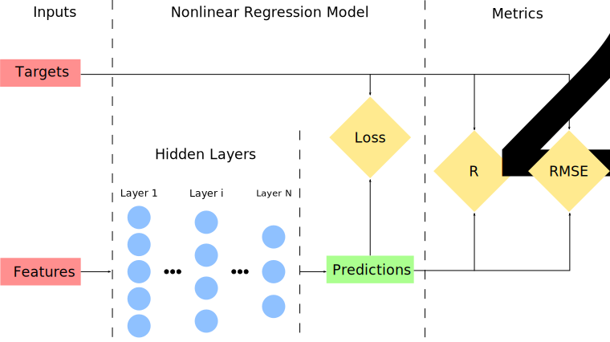

# Nonlinear Regression

In the previous chapters, we dealt with simple models that worked well for linear relationships. However, not everything can be described using linear functions, and therefore, use of the more sophisticated model is required. In this chapter, we will see how to convert the model for the Linear Regression to the modules for Nonlinear Regression or, in the other words, to the Feed-forward Neural Network.

For brevity, we will limit our further examples to the model that perform regression tasks, as from previous examples we saw that only difference between tasks is in the cost function.

## Graph Construction

In this example, we use the same synthetic data that we were using for the Linear Regression example with one slight modification for the target values. Here we perform an element-wise multiplication of `target_1` and `target_2` arrays instead of concatenating them. As the result, the shape of the final `target` array is `[1000, 1]` instead of `[1000, 2]`.

### Nonlinear Regression Model

As already mentioned, the graph presented here is, essentially, just an extension of the graph described in the previous chapter. Therefore, definitions of variables in `inputs` and `metrics` variable scopes as well as `loss` and `train_step` operations remain exactly the same as for the Linear Regression graph. The difference is in the definition of `prediction` tensor, where input parameter now has a tensor `h` instead of `x`.

```python
# Predictions are performed by Y_FEATURES neurons in the output layer
prediction = tf.layers.dense(inputs=h, units=Y_FEATURES, name="prediction")
```

Where `h` stands for hidden layers.

```python
with tf.variable_scope("hidden layers"):
    # Constructs hidden fully connected layer network
    h = hidden_layers(in_tensor=x, layers=LAYERS)
```

In this situation, tensor `h` \(hidden\) is equal to output of `hidden_layers()` function.

```python
def hidden_layers(in_tensor, layers):
    """
    Function stacks fully connected layers

    :param in_tensor: Input Tensor
    :type in_tensor: Tensor
    :param layers: List of dictionaries that contain a number of neurons for the particular layer ad the activation
    function in the layer
    :type layers: list(dict("units", "act_fn"))
    :return: Tensor of the last densely connected layer
    :rtype: Tensor
    """
    h_input = in_tensor
    for i, l in enumerate(layers):
        h_input = tf.layers.dense(inputs=h_input, units=l["units"], activation=l["act_fn"],
                                  name="hidden_{i}".format(i=i))
    return h_input
```

This function combines multiple fully-connected layers of a variable size. The first layer in the stack takes as an input tensor the `in_tensor` parameter, which in our example is `x` tensor. All subsequent layers take in previous layer output until the last layer is reached. The output of the last layer is also a return object of `hidden_layers()` function, that is `h` tensor. Function `hidden_layers()` has two parameters where the first, `in_tensor` is the node \(tensor\) to which the hidden layers will be connected to and `layers` parameter is the list of dictionaries for each layer describing number of units \(neurons\) and the type of the activation function per layer.

Computational graph for this model can be presented as



We can see that the graph is very similar to the graph presented for the Logistic Regression. In addition to the _Inputs, Regression Model and Metrics sections \_we now have \_Hidden Layers_ subsection that contains N number of fully-connected layers stacked layers. The output of this subsection is passed to the _Predictions_ node which then is used to compute `loss` and other quantities in _Metrics_ section.

In order to perform computations on the graph, we use same functions as in the previous examples. However, to show how to save and restore trained models we split the training cycle into two stages. To show the latter we are using

```python
with tf.Session() as sess:
```

to create a `Session` instead of `tf.InteractiveSession()`.

So, we start by training model for the first 1/3 of the total training epochs after which we save the model and detached the `Session` from the graph.

```python
save_path = saver.save(sess=sess, save_path=checkpoint_path)
print("Model saved in file: {path}".format(path=save_path))
```

Next, we create a new `Session` and connect it to the graph again. Then we load the previously saved model and continue to train the model.

```python
# Restore model from previously saved model
saver.restore(sess=sess, save_path=checkpoint_path)
print("Model restored from file: {path}".format(path=save_path))
```

## Saving and Restoring Models

The easiest way to [save and restore a model](https://www.tensorflow.org/versions/master/programmers_guide/saved_model) is to use a [`tf.train.Saver()`](https://www.tensorflow.org/api_docs/python/tf/train/Saver) operator in TensorFlow. The constructor adds save and restore _ops_ to the graph for all, or a specified list, of the variables in the graph. The _Saver_ operator provides methods to run these _ops_, specifying paths for the checkpoint files to write to or read from. Variables are saved in binary files that, roughly, contain a map from variable names to tensor values. When you create a _Saver_ operator, you can optionally choose names for the variables in the checkpoint files. By default, it uses the value of the `Variable.name` property for each variable. To understand what variables are in a checkpoint, you can use the `inspect_checkpoint` library, and in particular, the `tf.print_tensors_in_checkpoint_file()` function. If you do not pass any argument to `tf.train.Saver()` the saver handles all variables in the graph. Each one of them is saved under the name that was passed when the variable was created. It is sometimes useful to specify names for variables in the checkpoint files explicitly. For example, you may have trained a model with a variable named _weights_ whose value you want to restore in a new variable named _params_. It is also useful to only save or restore a subset of the variables used by a model.

```python
# Create some variables.
v1 = tf.Variable(..., name="v1")
v2 = tf.Variable(..., name="v2")
# Add ops to save and restore only "v2" using the name "my_v2"
saver = tf.train.Saver({"my_v2": v2})
# Use the saver object normally after that.
```

For example, you may have trained a neural net with 5 layers, and you now want to train a new model with 6 layers, restoring the parameters from the 5 layers of the previously trained model into the first 5 layers of the new model.You can easily specify the names and variables to save by passing to the `tf.train.Saver()` constructor a Python dictionary: keys are the names to use, values are the variables to manage.

You can create as many _Saver_ operators as you want if you need to save and restore different subsets of the model variables. The same variable can be listed in multiple _Saver_ operators, its value is only changed when the saver `restore()` method is run.

> Note: When you restore all variables from a file you do not have to initialize them beforehand, but if you only restore a subset of the model variables at the start of a `Session`, you have to run an initialize _op_ for the other variables.

## Optimizers

As before, in this example, we use the gradient descent algorithm to optimize the weights and biases. However, as mentioned before, TensorFlow has a large collection implemented optimization algorithms, see [here](https://www.tensorflow.org/api_guides/python/train). A good summary of different types of optimization algorithms is available [here](http://ruder.io/optimizing-gradient-descent/) and [here](https://leonardoaraujosantos.gitbooks.io/artificial-inteligence/content/model_optimization.html).

> Note: Right choice of optimization algorithms can significantly reduce training time as well as a quality of the model, therefore the algorithm is an additional hyperparameter that has to be considered.

## Activation functions

In this example, we introduced a notion of the [activation function](https://en.wikipedia.org/wiki/Activation_function) which is the essential part of the neural networks. It ensures that values in the network have nonlinear characteristics. Similarly to the optimization algorithms, TensorFlow has a collection of activation _ops_, the list of which is available [here](https://www.tensorflow.org/api_guides/python/nn). A good summary of different types of the activations functions is available [here](http://cs231n.github.io/neural-networks-1/).

In this example, for all hidden layers, we used [Rectified Linear Unit](https://en.wikipedia.org/wiki/Rectifier_%28neural_networks%29).

## Next

In this chapter, we saw how to create Feed-forward Neural Network just by adding a few lines of code to the linear regression model that we saw in the [previous chapter](linear-regression.md). Hence, current model allows us to make predictions for linear and also nonlinear processes. However, this network cannot be used if data, that we are interested in, have temporal dependencies. Thus in the [next chapter](introduction-to-recurrent-neural-network.md), we will show what to do in that situation.

## Code

* [03\_nonlinear\_regression.py](https://github.com/satonreb/machine-learning-using-tensorflow/blob/master/scripts/03_nonlinear_regression.py)

## References

* [Artificial Intelligence GitBook](https://www.gitbook.com/book/leonardoaraujosantos/artificial-inteligence/details)
* [CS231n: Convolutional Neural Networks for Visual Recognition](http://cs231n.github.io/)
* [Sebastian Ruder blog](http://ruder.io/#open)
* [Srivastava, N., Hinton, G., Krizhevsky, A., Sutskever, I., & Salakhutdinov, R. \(2014\). Dropout: A Simple Way to Prevent Neural Networks from Overfitting. Journal of Machine Learning Research, 15, 1929–1958.](https://www.cs.toronto.edu/~hinton/absps/JMLRdropout.pdf)
* Wikipedia articles on [Activation Function](https://en.wikipedia.org/wiki/Activation_function) and [Rectified Linear Unit](https://en.wikipedia.org/wiki/Rectifier_%28neural_networks%29)

